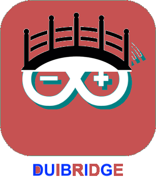

# duibridge

duibidge jeedom plugins

Ce plugins est fait d’abord fait pour ceux qui cherche à remplacer le plugins Arduidom sous Jeedom. Depuis que le plugins Arduidom qui a disparu du market Jeedom je cherche une solution pour le remplacer sans trop casser mon installation.

Plus globalement il permet la communication entre un Arduino USB et Jeedom via pritocol de messaging MQTT

Arduidom me permettais de communiquer entre Jeedom et un Arduino USB ( Nano ). Après qq recherche je me suis orienté vers une solution MQTT. Il y plusieurs plugins qui permettre de communiqué via MQTT. MQTT permet simplement d’envoyer ou de recevoir des informations. Toutes les informations sur MQTT sont disponible sur le web ![http://mqtt.fr/]
Pour les Arduino avec Ethernet ou Wifi ou les ESP il est possible de faire directement du MQTT sur l’Arduino. Dans mon cas je ne peux communiquer avec l’Arduino qu’en série ( USB ). Je suis donc reparti du Plugins Arduidom, j’ai gardé le Sketch de l'Arduino mais j’ai transformé le deamon pour qu’il communique plus directement avec Jeedom mais via MQTT. Finalement j’ai refait un Plugins Jeedom qui ne fait que gérer le deamon.

Schéma de connexion :
---------------------

Arduino <---USB----> RPI (deamon) <- MQTT-> Jeedom 

Pour mes tests coté Jeedom j'ai utilisé le plugins jMQTT. Coté Arduino on peut garder le sketch Arduidom pas de changement.

Pour le moment le plugins est limité à un seul Arduino. 

