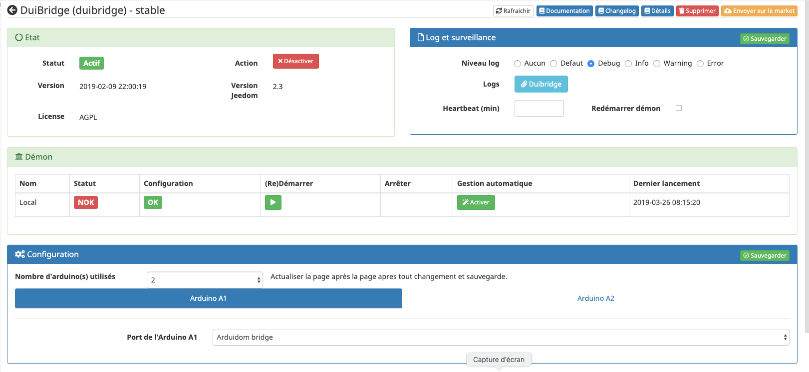
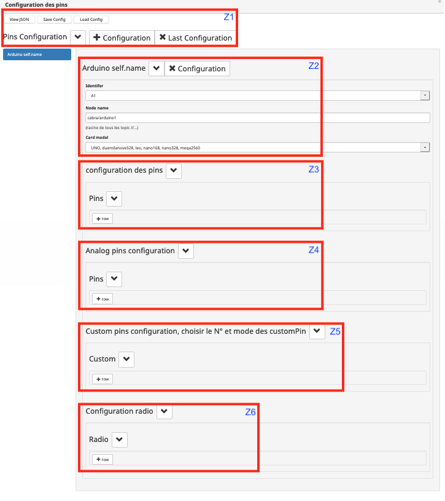
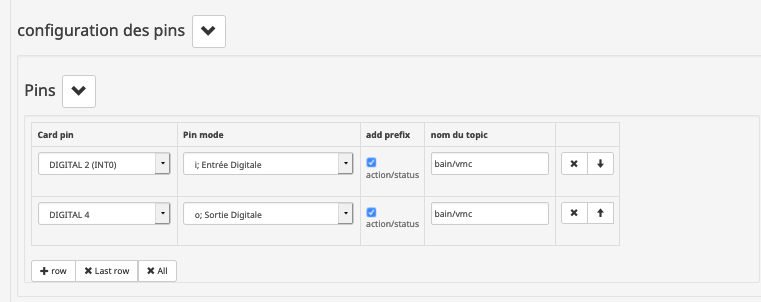
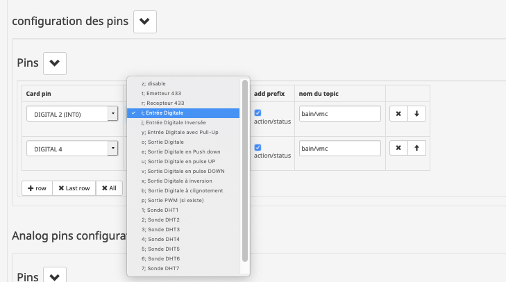
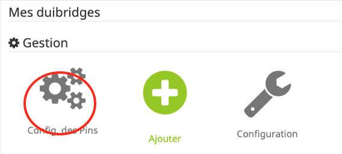

Description
===========
Ce plugins permet de réaliser un pont entre Jeedom et un Arduino connecté en serie (USB). La communication vers Jeedom est réalisée via [MQTT](https://mqtt.org/). Ce plugins nécessite donc l'utilisation d'un plugins MQTT pour Jeedom. Plusieurs plugins MQTT sont disponible sur le [market](https://www.jeedom.com/market/index.php?v=d&p=market&type=plugin&&name=mqtt)

Introduction
============

Configuration du plugin
=======================

Après le téléchargement du plugin, il vous suffit de l’activer et de le configurer.

Une fois activé, le démon devrait se lancer. Le plugin est préconfiguré avec des valeurs par défaut. Vous aurez plusieurs chose à changer:
* definir le nombre d'arduinos connectés
* pour chaque arduino definir le port USB utilisé
* pour chaque arduino la configuration des pins, c'est la partie la plus longue mais la plus importante.

Dépendances
-----------

> **Tip**
>
> La mise à jour des dépendances peut prendre plus de 10 minutes selon
> votre matériel. La progression est affichée en temps réel.

Démon
-----

Cette partie permet de valider l’état actuel du démon et de
configurer la gestion automatique de celui-ci.

* Le **Statut** indique que le démon est actuellement en fonction.

* La **Configuration** indique si la configuration du démon
    est valide.

* Le bouton **(Re)Démarrer** permet de forcer le redémarrage du
    plugin, en mode normal ou de le lancer une première fois.

* Le bouton **Arrête**, visible seulement si la gestion automatique
    est désactivée, force l’arrêt du démon.

* La **Gestion automatique** permet à Jeedom de lancer automatiquement
    le démon au démarrage de Jeedom, ainsi que de le relancer en cas
    de problème.

* Le **Dernier lancement** est comme son nom l’indique la date du
    dernier lancement connue du demon.

Log
---

Cette partie permet de choisir le niveau de log ainsi que d’en consulter le contenu.

[configuration05](../images/configuration05.png)

Sélectionner le niveau puis sauvegarder, le démon sera alors relancé
avec les instructions et traces sélectionnées.

Le niveau **Debug** ou **Info** peuvent être utiles pour comprendre
pourquoi le démon plante ou ne remonte pas une valeur.

> **Important**
>
> En mode **Debug** le démon est très verbeux, il est recommandé
> d’utiliser ce mode seulement si vous devez diagnostiquer un problème
> particulier. Il n’est pas recommandé de laisser tourner le démon en
> **Debug** en permanence, surtout si on utilise une **SD-Card**. 
> Une fois le debug terminé, il ne faut pas oublier de retourner sur un 
> niveau moins élevé comme le niveau **Error** qui ne remonte que 
> d’éventuelles erreurs.

Configuration
-------------

Cette partie permet de configurer les paramètres généraux du plugin

**Général** :

   * Le paramètre  **Nombre d'Arduinos connectés** vous permet d'indiquer au demon le nombre d'Arduino qu'il devra gérer
   * Les onglets **"Arduino A1"** à **"Arduino A8"** apparaissent en fonction nombre d'Arduino indiqué dans le paramètre  précedent.
   * Le paramètre  **Port de l'Arduino Ax** est accessible dans l'onglet correspondant, il permet d'indiquer le port USB utilisé pour connecter l'Arduino. 
       * une valeur particulier est disponible pour indiquer que l'Arduino est connecté via le plugins Arduidom  **Bridge Arduidom**.

> **Important**
> le mode **"Bridge Arduidom"** ne marche qu'avec le premier Arduino **"Arduino A1"** voir chapitre **Mode Bridge Arduidom**

Gestion des équipements
=======================
Il n'y pas d'équipement dans ce plugins. Le plugins a pour objectif de faire l'interface entre un Arduino série (USB) et le protocole MQTT. Les equipements peuvent etre créés via l'un des plugins MQTT disponible sous Jeedom. Tous les tests sont actuelement réalisés avec le plugins *jMQTT* mais les autres plugins MQTT sont utilisables.

Configuration des pins des Arduinos
===================================

C'est la partie la plus importante et la plus compliquée.
C'est à partir de cette configuration que le demon Duibridge fera le lien entre un **"topic MQTT"** et une **"pin"** de l'un des Arduinos.
Pour simplifier l'utlisation des topic MQTT il est recommander de bien séparer le topics de commande des topics de status ( retours ). Par example si vous avez une lampe pilotée via une pin et qui remonte son status sur une autre pin de l'Arduino. Dans Jeedom il faut deux commandes de type Action et une commande de type Info. Sur l'arduino il faudra deux pins, une **Digital out** pour piloté la lampe, une en **Digital In** pour remonté son status. Il faudra egalement deux topics un pour la pin qui pilote la lampe un pour remonté le status à Jeedom. L'un des avantage de MQTT est de pouvoir s'abonner facilement à une liste de topic et de sous topic.

Donc cela donne (mauvais choix):

Pin N° | Pin Type  | Topic 
---:|:-------------|---------
4 | Digital OUT | maison/salon/lampe/status 
5 | Digital IN | maison/salon/lampe/action 

c'est configuartion fonctionne mais cela n'est tres pratique si vous avez deux lampes dans votre salon. cela donnerai :

Donc cela donne (tuojours pas bon ):

Pin N° | Pin Type  | Topic |
---:|:-------------|:---------
4 | Digital OUT | maison/salon/lampe1/status
5 | Digital IN | maison/salon/lampe1/action
6 | Digital OUT | maison/salon/lampe2/status
7 | Digital IN | maison/salon/lampe2/action

si vous vouler vous abonner a tous les topics de status vous ne pouvez pas utliser les carateres générique proposer par MQTT. Si vous vous abonner à 
maison/salon/# par exemple vous serez abonné aussi au topic action.

**la bonne solution** est de séparer les topics ***action*** et ***status*** comme ceci:

Pin N° | Pin Type  | Topic 
---:|:-------------|:---------
4 | Digital OUT | maison/status/salon/lampe1
5 | Digital IN | maison/action/salon/lampe1
6 | Digital OUT | maison/status/salon/lampe2
7 | Digital IN | maison/action/salon/lampe2

De cette facon vous pouvez vous abonner à tous les topics status du piéce ou d'un équiment comme ceci:

    maison/status/#
ou à tous les status des equipements du salon :

    maison/action/#
>Note: avec jMQTT les commandes de type info (status) seront seront créées automatiquement à la premiere arrivée d'information.

L'écran de configuration de pins
--------------------------------

L'écran est composé de 6 zones:

**(Z1)** Boutons actions globales: 

- *[View Json]* permet d'avoir une vu du fichier JsOn de la configuration, pas très utile en fait.
- **[Save Config]** très important la configuration n'est pas sauvegardée si vous fermez la fenêtre avant d'avoir sauvegarger avec ce bouton.
- *[Load Confif]* normalement la configuration est charger des que vous ouvrez cette fenêtre mais au cas  
- [+ Configuration] permet de créer une configuration pour nouvelle carte.
- [X Last Configuration] supprime la dernière configuration de la liste 

**(Z2)** Permet de saisir les informations globales d’une carte arduino: 
- **Identifier** l'identifiant de l'arduino ici A1, correspond a l'identifier de l'arduino défini dans la configuration du plugins qui permet de définir le port USB correspondant.
- **Node, name** : permet de donner un nom a la configuration mais surtout de définir la racine de tous les topics qui seront associés à chaque pin.
- **Card model** : permet d’indiqué le model de la carte Ardiono, utile pour que le plugins en déduise le nombre de pin. 

**(Z3-Z6)** ces 4 zones permetent de definir la configutaion pour chaque type de Pin. D'abord le *Digital pins* puis les *Analog pins* les *Custom pins* et enfin la configuration radio. 

Tableau de configuration pins
-----------------------------
Dans chaque zone vous pouvez **ajouter / supprimer** des lignes qui vont correspondre aux pins que vous voulez configurer ou supprimer:

- **[ :heavy_plus_sign: row ] [ :heavy_multiplication_x: Last row ] [ :heavy_multiplication_x: All ]** ajouter une ligne (configuration pour une pin) / supprimer la dernière ligne / supprimer toutes les lignes.

Configuration d'une pin Digital
-------------------------------

- Le premier champs est le type de pin, toutes les types disponibles dans *Arduidom* sont aussi disponibles ici.
- **|add prefix|** *action/status* : permet au plugins de prefixer le topic avec *action* ou *status* en fonction du type *in* ou **out** de la pin.
- **|nom du topic|** nom du topic associé à la pin.

Attention le nom complet du topic sera composé du nom de la carte (saisie dans le champ **Node name**), de *action* ou *status* (si **add prefix** est coché) et enfin de la valeur du champ **nom du topic** donc {Node name}/{action/status/ ou rien}/{nom du topic}. 

Dans l'example cela donne : 
- Pin 2 = **cabra/arduino1**/*status*/**bain/vmc**
- Pin 4 = **cabra/arduino1**/*action*/**bain/vmc**

Configuration d'une pin Digital
-------------------------------

Identique aux chapitre pins Digital sauf que le type est limité a **entrée analogique**. 
 

Exemple d'utilation avec jMQTT
------------------------------
Dans cette example j'ai une *lampe de bureau de mon salon* est pilotée par la **pin 4** de l'**arduino N°1**   
Premiere étape cond-figuration des pin dans Duibridge. Pour cela aller sur le plugins **duibridge** et cliquer sur **Config des Pins**

la fenétre de configuration s'ouvre et la derniére configurarion est chargée (normalement :)) mais je vous recommande d'utliser le bouton   

Si cela n'est pas encore fait vous avez à definir la configuration du 1er arduino de votre installation.
l'identifiant sera A1 ( valeurs possible de A1 à A2 ) attenfiant correpond a l'identifaiant utlisé dans la configuration du plugin ou vous avez definir le port serie (USB) utlisé pour connecter l'arduino.

(1) **Identifier** l'identifant de l'arduino ici A1

(2) **Node name** le nom qui est aussi utilisé comme racite de tous les topics MQTT ici j'ai defini *cabra/arduino1*, cabra qui est le no de ma maison et arduino1 pour le 1er arduino de mon instalation

(3) **Card model**: model de l'arduino utliser pour definir le nombre de pin disponible. 

Ensuite vous avez a configurer les deux pins utisées pour le pilotage de la lampe. La Pin 5 dans l'exmaple en sotie Digital pilote le relais la pin 4 sert de retour pour indiquer l'etat de la lampe.

(1) choix de la pin 

Mode bridge Arduidom, migration Arduidom vers MQTT
--------------------------------------------------

